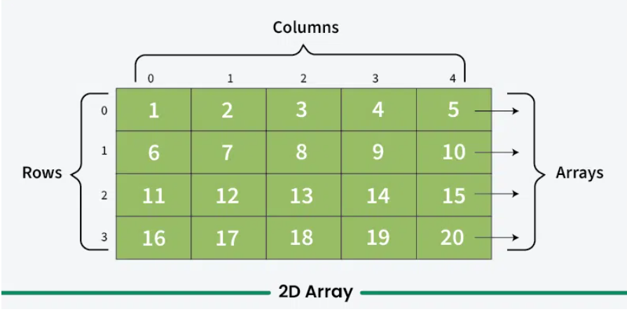
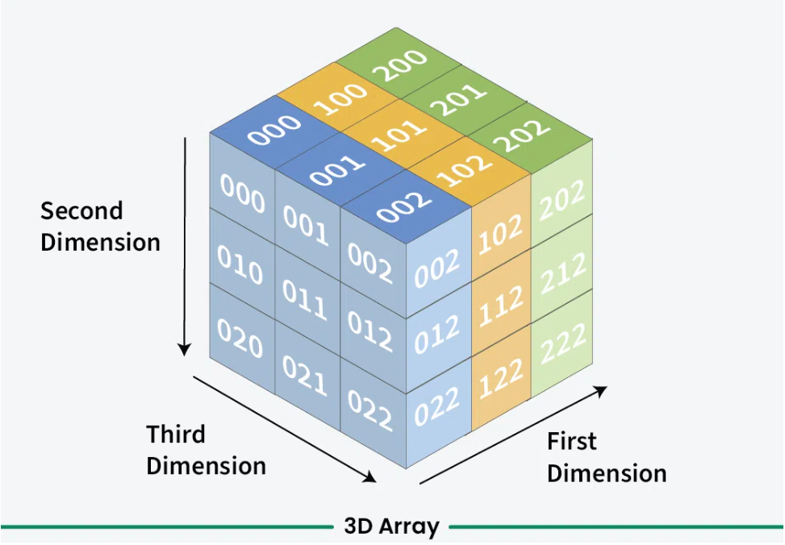
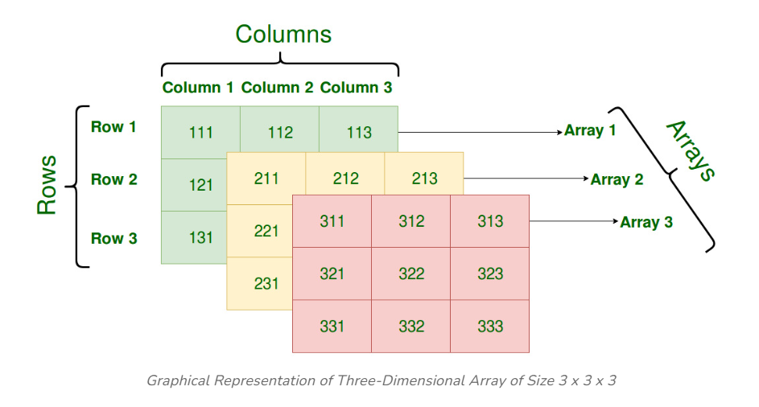

# Dynamic-Arrray-C
Reference:
- https://diveintosystems.org/book/C2-C_depth/arrays.html
- https://www.geeksforgeeks.org/multidimensional-arrays-in-c/

### Mảng 2D

    

### Mảng 3D
Mảng 3D trong C là tập hợp những mảng 2D xếp chống lên nhau

    

    

**Example**:
~~~c
#include <stdio.h>
#include <stdlib.h>

int main() {
    int x = 3, y = 3, z = 3;
    // x ở đây là số lượng mảng 2D - như là chiều cao được biểu diễn ở hình bên trên
    // y và z biểu thị cột và hàng của mảng 2D
    
    // Cấp phát bộ nhớ cho mảng 3D
    /*
     * x - số lượng mảng 2D
     * sizeof(int **) - kích thước mỗi mảng 2D
     */
    int ***array = (int ***)malloc(x * sizeof(int **)); 
    
     
    
    /*
    Ta hiểu vòng for dùng để cấp phát bên dưới như sau.
    array[i] = (int **)malloc(y * sizeof(int *)); --> Dùng để cấp phát mỗi phần từ (mảng 2D) trong mảng 3D nên mới có 
    (int **malloc) - y là số hàng
    
    sau đó dựa vào i - chiều cao, y - số hàng --> Từ đó ta mới tiếp tục cấp phát cho từng cột
    array[i][j] = (int *)malloc(z * sizeof(int));
    
    */
    for (int i = 0; i < x; i++) {
        array[i] = (int **)malloc(y * sizeof(int *));
        for (int j = 0; j < y; j++) {
            array[i][j] = (int *)malloc(z * sizeof(int));
        }
    }
    
    // Gán giá trị và truy xuất phần tử
    for (int i = 0; i < x; i++) {
        for (int j = 0; j < y; j++) {
            for (int k = 0; k < z; k++) {
                array[i][j][k] = i * 100 + j * 10 + k;
            }
        }
    }
    
    // In giá trị của mảng
    for (int i = 0; i < x; i++) {
        for (int j = 0; j < y; j++) {
            for (int k = 0; k < z; k++) {
                printf("array[%d][%d][%d] = %d\n", i, j, k, array[i][j][k]);
            }
        }
    }

    // Giải phóng bộ nhớ
    // Thứ tự từ giải phóng: cột --> hàng --> mảng 2D
    for (int i = 0; i < x; i++) {
        for (int j = 0; j < y; j++) {
            free(array[i][j]);
        }
        free(array[i]);
    }
    free(array);

    return 0;
}

~~~
